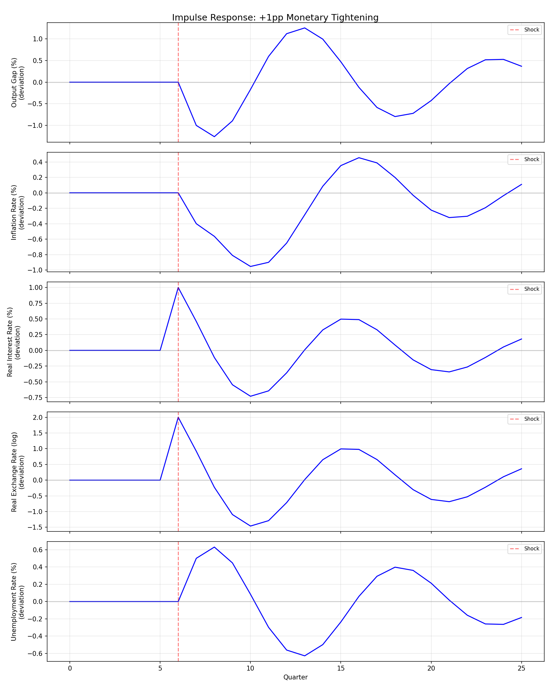
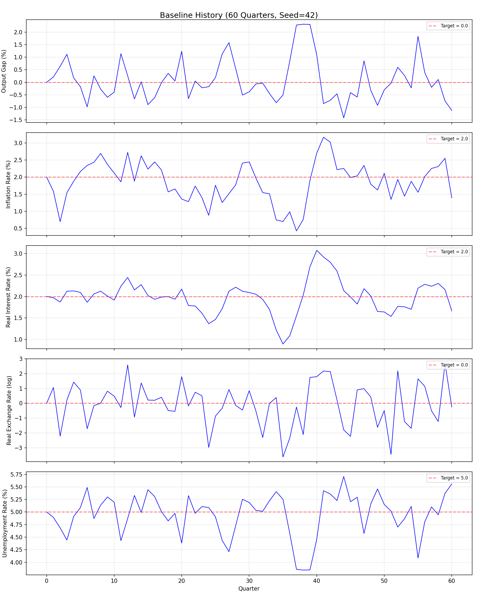
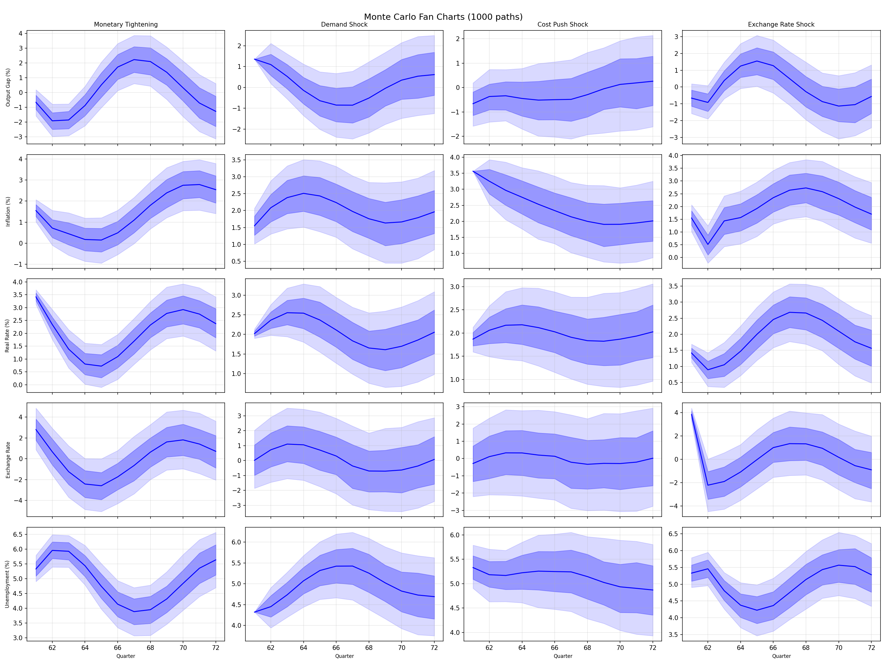

# LLMMatrix Simulator Validation Report
**Overall status: ALL CHECKS PASSED**
## 1. Stability (Eigenvalue Check)
**PASS** — Max eigenvalue modulus: 0.9289
Eigenvalue moduli:
- λ_1: 0.9289
- λ_2: 0.9289
- λ_3: 0.6652
- λ_4: 0.0000
- λ_5: 0.0000

## 2. Bounded Trajectories
**PASS** — 0 violations found

Variable ranges across 1000 simulations:
| Variable | Min | Max |
|----------|-----|-----|
| y | -6.60 | 7.03 |
| pi | -2.08 | 6.15 |
| r | -1.80 | 5.63 |
| e | -9.38 | 10.08 |
| u | 1.48 | 8.30 |

## 3. Steady-State Recovery
**PASS**

Recovery periods (quarters after shock):
| Variable | Periods to Recover | Final Deviation |
|----------|-------------------|------------------|
| y | 44 | 0.010497 |
| pi | 36 | 0.016215 |
| r | 35 | 0.019042 |
| e | 46 | 0.038083 |
| u | 37 | 0.005248 |

## 4. Realistic Volatility
**PASS**

| Variable | Simulated Std | Empirical Std | Ratio |
|----------|--------------|---------------|-------|
| y | 1.552 | 1.500 | 1.03 |
| pi | 0.963 | 1.000 | 0.96 |
| r | 0.839 | 1.500 | 0.56 |
| e | 2.240 | 4.000 | 0.56 |
| u | 0.776 | 1.000 | 0.78 |

## 5. Impulse Response Sanity
**PASS**
- [PASS] y declines after monetary tightening
- [PASS] pi declines after monetary tightening
- [PASS] e appreciates on monetary tightening
- [PASS] u rises after monetary tightening

## 6. AR(1) Suboptimality
**PASS** — AR(1) worse on 5/5 variables

| Variable | AR(1) MSE | Oracle MSE | AR(1) Excess (%) |
|----------|-----------|------------|------------------|
| y | 0.7140 | 0.0030 | 23819.6% |
| pi | 0.1480 | 0.0024 | 5944.1% |
| r | 0.1638 | 0.0009 | 17260.0% |
| e | 0.4466 | 0.0076 | 5776.4% |
| u | 0.1785 | 0.0007 | 23819.6% |

## Plots

